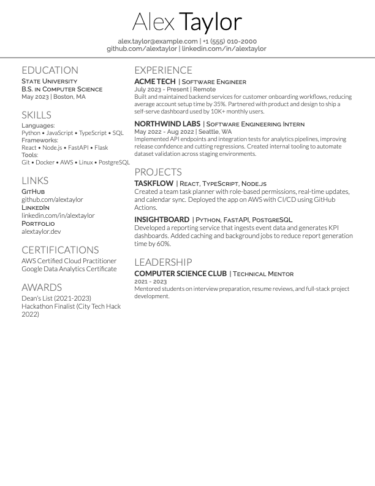

# LaTeX Resume Template

A clean, public-ready resume template based on Deedy Resume with open-source fonts and XeLaTeX support.

This repository is designed so anyone can clone it, build immediately, and then customize `main.tex` with their own content.

## Preview



## Features

- Two-column professional layout
- Open-source fonts included in the repo
- One-command build with `latexmk` + XeLaTeX
- GitHub-safe structure with personal/private file workflow
- Build outputs isolated to the `build/` folder

## Quick Start

### 1) Clone the repo

```bash
git clone <your-repo-url>
cd overleaf
```

### 2) Build the sample resume (first time)

```bash
latexmk -C main.tex
latexmk -xelatex -interaction=nonstopmode -halt-on-error -outdir=build main.tex
```

Output: `build/main.pdf`

### 3) Customize your resume

Edit `main.tex`:
- Update `\namesection` with your name and contact
- Replace content in `Education`, `Experience`, `Skills`, and `Projects`

### 4) Rebuild after edits

```bash
latexmk -xelatex -interaction=nonstopmode -halt-on-error -outdir=build main.tex
```

Every build writes the generated resume to:

- `build/main.pdf`

## Build Commands

Use these day-to-day commands:

```bash
# Build
latexmk -xelatex -interaction=nonstopmode -halt-on-error -outdir=build main.tex

# Clean temporary build files for this document
latexmk -C main.tex
```

## Requirements

- LaTeX distribution with XeLaTeX (MacTeX, BasicTeX, or TinyTeX)
- `latexmk`

Verify your tools:

```bash
xelatex --version
latexmk --version
```

## Keep Personal Resume Local (Untracked)

This repo is configured so `main.personal.tex` is ignored by git.

Recommended workflow:

```bash
cp main.tex main.personal.tex
```

- Keep your private version in `main.personal.tex`
- Keep `main.tex` generic/public for GitHub

## Project Structure

```text
.
├── main.tex                  # Public template
├── main.personal.tex         # Local/private copy (gitignored)
├── deedy-resume-openfont.cls # Resume class
├── fonts/                    # Lato + Raleway fonts
├── assets/                   # README images
└── build/                    # PDF and LaTeX build output
```

## What To Track In Git

- Track source files like `main.tex`, class files, fonts, images, and docs.
- Do not track LaTeX temporary artifacts such as `.aux`, `.log`, `.out`, `.xdv`, `.fls`, `.fdb_latexmk`, `.synctex.gz`.
- Generated `main.pdf` can be rebuilt by anyone with one command, so it is usually better to keep it untracked.

## License

Licensed under Apache 2.0. See [LICENSE.txt](LICENSE.txt).

